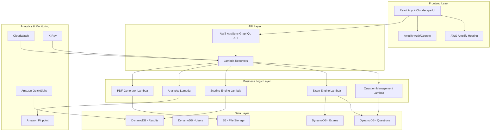

# Design Document - AWS Certification Practice Platform

## Overview

The AWS Certification Practice Platform is designed as a fully serverless application leveraging AWS managed services to provide a scalable, cost-effective, and secure exam simulation environment. The architecture follows AWS Well-Architected Framework principles with emphasis on operational excellence, security, reliability, performance efficiency, and cost optimization.

The platform consists of a React frontend using Cloudscape Design System hosted on AWS Amplify, with a serverless backend powered by AWS AppSync (GraphQL), Lambda functions, DynamoDB, and various AWS services for analytics, storage, and monitoring.

## Architecture

### High-Level Architecture



### Technology Stack

**Frontend:**
- React 18+ with TypeScript
- Cloudscape Design System for AWS-native UI components
- AWS Amplify SDK for authentication and API integration
- React Router for navigation
- React Query for state management and caching

**Backend:**
- AWS AppSync for GraphQL API gateway
- AWS Lambda (Node.js 18+) for business logic
- Amazon DynamoDB for NoSQL data storage
- Amazon S3 for file storage and static assets
- Amazon Cognito for authentication and user management

**Analytics & Monitoring:**
- Amazon Pinpoint for user analytics and tracking
- Amazon QuickSight for business intelligence dashboards
- AWS CloudWatch for logging and monitoring
- AWS X-Ray for distributed tracing
- AWS CloudTrail for audit logging

## Components and Interfaces

### Frontend Components

#### 1. Authentication Module
- **LoginComponent**: Handles Cognito authentication flows
- **ProfileComponent**: User profile management
- **ProtectedRoute**: Route guards for authenticated users

#### 2. Exam Interface Components
- **ExamHeader**: Timer, progress indicator, exam metadata
- **QuestionDisplay**: Question rendering with support for MCQ/MRQ
- **NavigationSidebar**: Question navigator with status indicators
- **ExamControls**: Previous/Next/Mark for Review/End Exam buttons
- **ReviewModal**: Pre-submission review interface

#### 3. Results and Analytics Components
- **ResultsDisplay**: Scaled scoring and domain breakdown
- **ProgressDashboard**: Charts and progress visualization
- **BadgeSystem**: Gamification elements
- **ExportControls**: PDF export functionality

#### 4. Admin Components
- **QuestionBankManager**: CRUD operations for questions
- **ExamTemplateBuilder**: Exam configuration interface
- **UserManagement**: Admin user oversight
- **AnalyticsDashboard**: Embedded QuickSight dashboards

### Backend Services

#### 1. Authentication Service
```typescript
interface AuthService {
  authenticateUser(credentials: UserCredentials): Promise<AuthResult>
  refreshToken(refreshToken: string): Promise<TokenResult>
  getUserProfile(userId: string): Promise<UserProfile>
}
```

#### 2. Question Management Service
```typescript
interface QuestionService {
  createQuestion(question: QuestionInput): Promise<Question>
  getQuestionsByFilters(filters: QuestionFilters): Promise<Question[]>
  updateQuestion(id: string, updates: QuestionUpdate): Promise<Question>
  deleteQuestion(id: string): Promise<boolean>
  importQuestionsFromCSV(s3Key: string): Promise<ImportResult>
}
```

#### 3. Exam Engine Service
```typescript
interface ExamService {
  generateExam(template: ExamTemplate): Promise<Exam>
  startExam(examId: string, userId: string): Promise<ExamSession>
  submitAnswer(sessionId: string, questionId: string, answer: Answer): Promise<void>
  submitExam(sessionId: string): Promise<ExamResult>
  getExamProgress(sessionId: string): Promise<ExamProgress>
}
```

#### 4. Scoring Service
```typescript
interface ScoringService {
  calculateScaledScore(answers: Answer[], questions: Question[]): Promise<ScaledScore>
  generateDomainBreakdown(result: ExamResult): Promise<DomainBreakdown>
  updateUserProgress(userId: string, result: ExamResult): Promise<void>
}
```

## Data Models

### Core Entities

#### User Profile
```typescript
interface UserProfile {
  userId: string
  email: string
  name: string
  targetCertifications: string[]
  preferences: UserPreferences
  createdAt: string
  updatedAt: string
}
```

#### Question
```typescript
interface Question {
  questionId: string
  certification: string
  domain: string
  difficulty: 'EASY' | 'MEDIUM' | 'HARD'
  questionText: string
  questionType: 'MCQ' | 'MRQ'
  options: QuestionOption[]
  correctAnswers: string[]
  explanation: string
  references: Reference[]
  tags: string[]
  createdBy: string
  createdAt: string
  updatedAt: string
}
```

#### Exam Session
```typescript
interface ExamSession {
  sessionId: string
  userId: string
  examType: 'MOCK' | 'PRACTICE' | 'CUSTOM'
  certification: string
  questions: Question[]
  answers: Map<string, Answer>
  startTime: string
  endTime?: string
  timeLimit: number
  status: 'IN_PROGRESS' | 'COMPLETED' | 'EXPIRED'
  markedForReview: string[]
}
```

#### Exam Result
```typescript
interface ExamResult {
  resultId: string
  sessionId: string
  userId: string
  scaledScore: number
  passed: boolean
  domainBreakdown: DomainScore[]
  totalQuestions: number
  correctAnswers: number
  completedAt: string
  timeSpent: number
}
```

### DynamoDB Table Design

#### Questions Table
- **Partition Key**: `certification#domain` (e.g., "SAA-C03#EC2")
- **Sort Key**: `questionId`
- **GSI1**: `difficulty#createdAt` for filtering by difficulty
- **GSI2**: `createdBy#createdAt` for admin queries

#### Users Table
- **Partition Key**: `userId`
- **GSI1**: `email` for email-based lookups

#### ExamSessions Table
- **Partition Key**: `userId`
- **Sort Key**: `sessionId`
- **GSI1**: `status#startTime` for active session queries
- **TTL**: `expiresAt` for automatic cleanup

#### Results Table
- **Partition Key**: `userId`
- **Sort Key**: `completedAt`
- **GSI1**: `certification#completedAt` for certification-specific analytics

## Error Handling

### Frontend Error Handling
- **Network Errors**: Retry mechanism with exponential backoff
- **Authentication Errors**: Automatic token refresh and re-authentication
- **Validation Errors**: Real-time form validation with user-friendly messages
- **Exam Interruption**: Auto-save mechanism every 30 seconds

### Backend Error Handling
- **Lambda Error Handling**: Structured error responses with appropriate HTTP status codes
- **DynamoDB Errors**: Retry logic for throttling and temporary failures
- **S3 Errors**: Fallback mechanisms for file operations
- **External Service Errors**: Circuit breaker pattern for third-party integrations

### Error Response Format
```typescript
interface ErrorResponse {
  error: {
    code: string
    message: string
    details?: any
    timestamp: string
    requestId: string
  }
}
```

## Testing Strategy

### Frontend Testing
- **Unit Tests**: Jest + React Testing Library for component testing
- **Integration Tests**: Cypress for end-to-end exam flow testing
- **Visual Regression Tests**: Percy for UI consistency
- **Accessibility Tests**: axe-core integration for WCAG compliance

### Backend Testing
- **Unit Tests**: Jest for Lambda function testing
- **Integration Tests**: AWS SDK mocking for service integration
- **Load Tests**: Artillery for performance testing
- **Security Tests**: OWASP ZAP for vulnerability scanning

### Test Data Management
- **Mock Data**: Faker.js for generating realistic test data
- **Test Environments**: Separate AWS accounts for dev/staging/prod
- **Database Seeding**: Automated scripts for consistent test data

### Performance Testing Scenarios
1. **Concurrent Exam Taking**: 1000 simultaneous exam sessions
2. **Question Bank Operations**: Bulk import of 10,000 questions
3. **Analytics Queries**: Complex reporting with large datasets
4. **Auto-scaling**: Gradual load increase to test Lambda scaling

## Security Considerations

### Authentication & Authorization
- **Multi-Factor Authentication**: Cognito MFA enforcement
- **JWT Token Management**: Short-lived access tokens with refresh rotation
- **Role-Based Access Control**: Fine-grained permissions for admin functions
- **Session Management**: Secure session handling with timeout policies

### Data Protection
- **Encryption at Rest**: DynamoDB and S3 encryption with AWS KMS
- **Encryption in Transit**: TLS 1.3 for all API communications
- **Data Masking**: PII protection in logs and analytics
- **Backup Security**: Encrypted backups with access controls

### API Security
- **AWS WAF**: Protection against common web attacks
- **Rate Limiting**: API throttling to prevent abuse
- **Input Validation**: Comprehensive validation at API gateway level
- **CORS Configuration**: Strict cross-origin resource sharing policies

### Monitoring & Compliance
- **Audit Logging**: CloudTrail for all administrative actions
- **Security Monitoring**: GuardDuty for threat detection
- **Compliance**: GDPR and SOC 2 compliance considerations
- **Incident Response**: Automated alerting for security events

## Performance Optimization

### Frontend Optimization
- **Code Splitting**: Route-based and component-based lazy loading
- **Caching Strategy**: Service worker for offline capability
- **Bundle Optimization**: Tree shaking and minification
- **CDN Distribution**: CloudFront for global content delivery

### Backend Optimization
- **Lambda Performance**: Provisioned concurrency for critical functions
- **DynamoDB Optimization**: Efficient query patterns and indexing
- **Caching Layer**: ElastiCache for frequently accessed data
- **Connection Pooling**: RDS Proxy for database connections (if needed)

### Monitoring & Alerting
- **Performance Metrics**: Custom CloudWatch metrics for business KPIs
- **Real User Monitoring**: Pinpoint for user experience tracking
- **Synthetic Monitoring**: CloudWatch Synthetics for uptime monitoring
- **Cost Monitoring**: AWS Cost Explorer integration for budget alerts